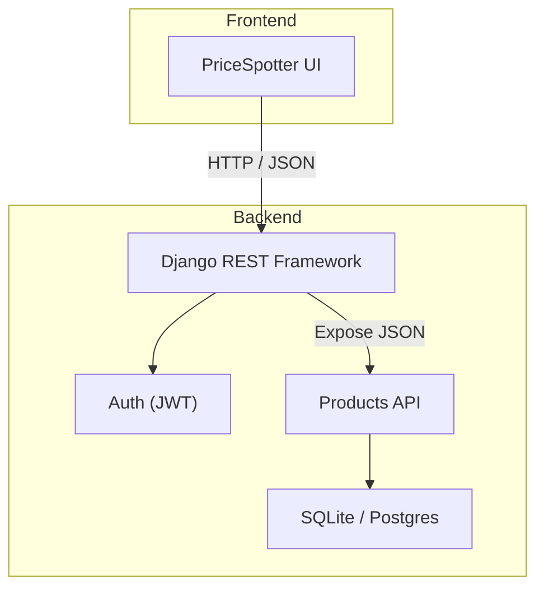

# PriceSpotterBackEnd

**PriceSpotterBackEnd** is a Django‑based backend API that powers the PriceSpotter product‑comparison application.  
It exposes RESTful endpoints for products, supports user authentication, and provides an admin dashboard for internal data management.

> **Status:** Alpha – active development

[](#license)
[](https://www.python.org/)
[](https://www.djangoproject.com/)

---

## Table of Contents

1. [Features](#features)
2. [Architecture](#architecture)
3. [Prerequisites](#prerequisites)
4. [Local Setup](#local-setup)
5. [Environment Variables](#environment-variables)
6. [Running Tests](#running-tests)
7. [API Reference](#api-reference)
8. [Docker Usage](#docker-usage)
9. [Contributing](#contributing)
10. [License](#license)

## Features

- **User Authentication** – JWT‑based registration, login, and protected endpoints  
- **Product CRUD** – create, read, update, and delete products via REST API  
- **Search & Filtering** – basic query parameters for name, store, and price range  
- **Django Admin** – built‑in dashboard for easy data administration  
- **Automated Tests** – Pytest + Django for unit and integration testing  

## Architecture



## Prerequisites

- Python 3.11+  
- [Poetry](https://python-poetry.org/) **or** `pip` & `virtualenv`  
- (Optional) Docker 24+

## Local Setup

```bash
# 1. Clone
git clone https://github.com/crankyjoke/PriceSpotterBackEnd.git
cd PriceSpotterBackEnd

# 2. Create & activate virtualenv
python3 -m venv .venv
source .venv/bin/activate          # Windows: .venv\Scripts\activate

# 3. Install deps
pip install -r requirements.txt

# 4. Configure env vars
cp .env.example .env   # then edit values as needed

# 5. Apply migrations & seed data
python manage.py migrate
python manage.py loaddata fixtures/*.json  # if fixtures exist

# 6. Run the dev server
python manage.py runserver
```

Visit **http://127.0.0.1:8000/** for the application and **/admin/** for the admin site.

## Environment Variables

Create a `.env` file in the project root (or export vars in your shell):

| Name               | Default                    | Description                           |
|--------------------|----------------------------|---------------------------------------|
| `DJANGO_SECRET_KEY`| _required_                 | Django crypto key                     |
| `DEBUG`            | `True`                     | Enable debug mode                     |
| `DATABASE_URL`     | `sqlite:///db.sqlite3`     | Database connection string            |
| `ALLOWED_HOSTS`    | `localhost,127.0.0.1`      | Comma‑separated host list             |

## Running Tests

```bash
pip install -r requirements-dev.txt
pytest
```

## API Reference

| Method | Endpoint               | Description                 |
|--------|------------------------|-----------------------------|
| GET    | `/api/products/`       | List products               |
| POST   | `/api/products/`       | Create a new product        |
| GET    | `/api/products/{id}/`  | Retrieve product details    |
| PUT    | `/api/products/{id}/`  | Update a product            |
| DELETE | `/api/products/{id}/`  | Delete a product            |

> **Note:** Endpoints under `/api/` are versioned (`/api/v1/`) in production and require an `Authorization: Bearer <token>` header once authenticated.

## Docker Usage

```bash
# Build the image
docker build -t pricespotter-backend .

# Run the container
docker run -d --env-file .env -p 8000:8000 pricespotter-backend
```

Or use **docker‑compose**:

```bash
docker compose up --build
```

## Contributing

1. Fork the repo & create your branch: `git checkout -b feature/awesome`
2. Commit your changes: `git commit -m 'Add awesome feature'`
3. Push to the branch: `git push origin feature/awesome`
4. Open a Pull Request 🚀

Please make sure your code passes `pytest` and `flake8` before submitting.

## License

Distributed under the **MIT** License.  
See the [`LICENSE`](LICENSE) file for full details.
